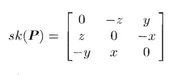
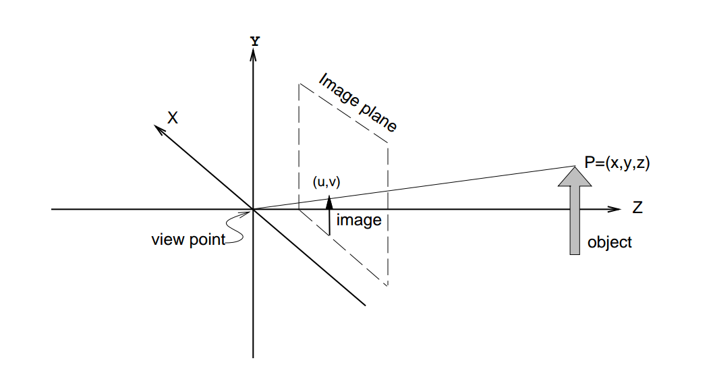
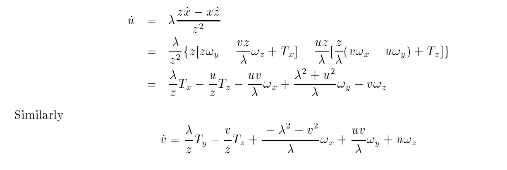
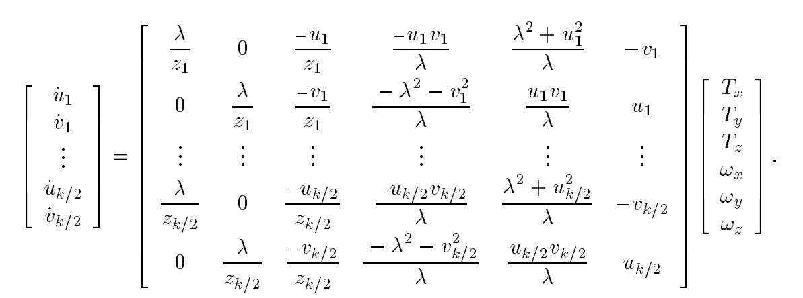

# image-based visual servo simulated in gazebo

| 文档名称      | image-based visual servo simulated in gazebo |  备注  |
| --------- | ---------------------------------------- | :--: |
| 项目名称      | 人工智能机械手实战                                |      |
| 项目编号（如适用） | AU05016                                  |      |
| 实验人       | 游仁春                                      |      |
| 实验编号（如适用） | NA                                       |      |
| 实验日期      | 2017.12.26                               |      |
| 文档版本      | 2017-09-04                               | Rev1 |

[TOC]

## 一、实验目的

1. 学习image-based visual servo的理论，确认image-based visual servo是否依赖于机械手的绝对坐标信息。

2. 在仿真中实现算法

   a) 输入为针脚和洞孔在同一张图片中的点

   b) 输出为机械手控制命令

   c) 在多次迭代的过程中，针脚应该逐渐靠近洞孔(或虚拟点)，并且最终重合

3. 探究眼手标定对实验结果的影响

  ​

## 二、实验设计及原理

本实验采用双目相机固定的image-based visual servo方法，在gazebo仿真环境中模拟机械手的在PCB板中插电容的任务。

## 三、实验环境

### 软件部分：

1. 操作系统版本
    ubuntu 14.04 LTS
2. Python版本，以及用到的第三方python库的版本。
  (a) Python版本：python 2.7.6
  (b) 第三方工具包版本:numpy (1.8.2)， matplotlib (2.0.2)等
3. gazebo仿真软件

### 硬件部分

工作电脑

## 四、实验步骤

1.在gazebo中用image-based visual servo算法实现插机任务，具体步骤包括：

a) 输入为针脚和洞孔在同一张图片中的点

b) 输出为机械手控制命令

c) 在多次迭代的过程中，针脚应该逐渐靠近洞孔(或虚拟点)，并且最终重合

**特别注意**：设置虚拟点十分必要，因为如果不设置虚拟点，在针脚追踪洞孔的过程中有可能碰到PCB板，导致针脚被掰弯！

2.将相机相对于robot base的转换矩阵Tc2r分别进行不同角度的旋转和平移，观察实验结果。

## 五、image-based visual servo 理论学习

### 1.Define

1. Move from current to desired robot configuration
2. Control feedback generated by computer vision techniques

### 2.Classification

Controlling Robots using visual information
• Camera location: Eye-in-hand vs. **fixed**
• Camera: mono vs. **stereo**
• Control: **image-based** vs. position-based

### 3.image based visual servo

Determine a error function $$e$$,  when the task is achieved, $$e=0$$.

$$e=f-f_d$$     (1)

where $$f_d$$: desired image features, $$f$$: image feature with respect to moving object.

**Note:** $$f$$ is designed in image  parameter space, not task space.

For insertion machine 

- if camera is fixed type:

  $$f_d$$: coordinates of  holes.

  $$f$$: coordinates of pins.

- if camera is eye-in-hand type:

  $$f_d$$: coordinates of pins

  $$f$$: coordinates of holes

#### A. Basic components

Let $$r$$ represent coordinates of the end-effector and $$\dot{r}$$ represent the corresponding end-effector velocity,  $$f$$ represent a vector of image features, then 

$$\dot{f}=J_v(r)\dot{r}$$     (2)

where $$J_v(r)∈R^{k*6}$$  is called jacobian matrix.

Using (1) and (2)

$$\dot{e}=J_v(r)\dot{r}$$ 

If we ensure an exponential decoupled decrease of the error($$\dot{e}=-Ke$$)

$$\dot{r}=J_v^{+}(r)\dot{e}=-KJ_v^{+}(r)e(f)=-KJ_v^{+}(r)(f-f_d)$$

#### B. The image jacobian

Note that $$J_v(r)∈R^{k*6}$$

if $$k=6$$, then $$ J_v^{+}=J_v^{-1}$$

if $$k>6$$, then $$ J_v^{+}=J_v^{T}(J_{v}J_{v}^{T})^{-1}$$

if $$k<6$$, then $$\dot{r} =J_v^{+}(\dot{f})+(I-J_v^{+}J_{v})b$$, and all vectors of the form $$(I-J_v^{+}J_{v})b$$  lie in the null space of $$J_v$$ 

> **In our case**
>
> We use two eye-in-hand cameras, so $$k=8 $$, note that we use mask to filter some dimensions
>

#### C. An Example Image Jacobian

##### I. The velocity of a  rigid object

Consider the robot end-effector moving in a workspace. In base coordinates, the motion is described by an angular velocity $$Ω(t) = [w_x(t),w_y(t), w_z(t)]^T$$ and a translational velocity $$T(t) = [T_x(t),T_y(t),T_z (t)]^T$$.  Let $$P$$ be a point that is rigidly attached to the end-effector, with base frame coordinates $$[x, y , z]^T$$ . The derivatives of the coordinates of $$P$$ with respect to base coordinates are given by 

**Note**: any objects rigidly attached to the end-effector share the same angular and translational velocity.

which can be written in vector notation as 

This can be written concisely in matrix form by noting that the cross product can be represented in terms of the skew-symmetric matrix 

allowing us to write 

Together, $$T$$ and $$Ω$$ define what is known in the robotics literature as a velocity screw.

##### II.**Review pinhole camera model**

A point, $$^{c}P = [x, y, z]^T$$ , whose coordinates are expressed with respect to the camera coordinate frame, will project onto the image plane with coordinates $$p = [u, v]^T$$ , given by

##### III.Example

Suppose that the end-effector is moving with angular velocity $$Ω(t)$$ and translational velocity $$T$$ both with respect to the camera frame in a fixed camera system. Let $$P$$ be a point **rigidly** attached to the end-effector. The velocity of the point $$P$$, expressed relative to the camera frame, is given by 

To simplify notation, let $$^{c}P = [x, y,z]^T $$. we can write the derivatives of the coordinates of p in terms of the image feature parameters $$u,v$$ as 

Now, let $$f = [u, v]^T$$ , because 

then we can get

Finally, we may rewrite these two equations in matrix form to obtain

which is an important result relating **image-plane velocity** **of a point** to **the relative velocity of the point with respect to the camera**. 

Visual control by simply stacking the Jacobians for each pair of image point coordinates

### 4.code

黄凯焕写的visual servo代码中包含了`VisualServo`,  `VisualServoPositionBase` and `VisualServoImageBase`三个类，其中父类VisualServo和ViusalServoImageBase是我们需要用到的。详细注解参看下面的代码。

#### I.Base class

Base class is `VisualServo`,  `VisualServoPositionBase` and `VisualServoImageBase`

~~~python
class VisualServo(object):
    @classmethod
    def _calImageJacobian(cls, intrinsic, x, y, z):
        fx = intrinsic[0, 0] # focal length
        fy = intrinsic[1, 1]
        cx = intrinsic[0, 2] # center
        cy = intrinsic[1, 2]

        u = x - cx
        v = y - cy
        J = np.array([[fx/z,    0, -u/z,        -(u*v)/fy, (fx**2+u**2)/fx, -(fx*v)/fy],
                      [   0, fy/z, -v/z, -(fy**2+v**2)/fy,        (u*v)/fx, (fy*u)/fx]])
        return J

    @classmethod
    def filterMoveDimension(cls, JMatrix, mask=(1,1,1,1,1,1)):
        assert isinstance(JMatrix, np.ndarray)
        assert JMatrix.shape[1] == len(mask), 'The column of JMatrix == len(Mask)'

        NonZero = np.nonzero(mask)
        FilterMatrix = np.zeros_like(JMatrix)
        FilterMatrix[:, NonZero] = JMatrix[:, NonZero]
        return FilterMatrix

    @classmethod
    def skewMatrix(cls, t):
        '''
        sk(p) = [0, -z, y
                 z, 0, -x
                 -y, x, 0]
        :param t:
        :return:
        '''
        assert t.shape == (3,1), 't must be a 3 by 1 vector'
        sk = np.array([[      0, -t[2,0],  t[1,0]],
                       [ t[2,0],       0, -t[0,0]],
                       [-t[1,0],  t[0,0],       0]])
        return sk

    @classmethod
    def _velocityTranMatrix(cls, Tx2x):
        #TODO
        R_cr = Tx2x[0:3, 0:3]
        t_cr = Tx2x[0:3, 3].reshape(3,1)
        sk_t = cls.skewMatrix(t_cr)

        VMatrix_c2r = np.hstack((R_cr, np.dot(sk_t, R_cr)))
        temp = np.hstack((np.zeros((3,3)), R_cr))
        VMatrix_c2r = np.vstack((VMatrix_c2r, temp))

        return VMatrix_c2r

    @classmethod
    def transVelocity(cls, Tx2x, velocity):
        return cls._velocityTranMatrix(Tx2x=Tx2x).dot(velocity)

    # @classmethod
    # def velocityPose2T(cls, velocityPose):
    #     DeltaPose = np.zeros((6,1)).astype('float32')
    #     DeltaPose[:3] = velocityPose[:3]
    #     DeltaPose[3]  = velocityPose[5]/math.pi*180
    #     DeltaPose[4]  = velocityPose[4]/math.pi*180
    #     DeltaPose[5]  = velocityPose[3]/math.pi*180
    #     T = core.Pose2T(pose=DeltaPose)
    #     return T

    @classmethod
    def velocityPose2Move(cls, velocityPose, iter=1):
        assert isinstance(velocityPose, np.ndarray)
        assert velocityPose.shape == (6,1)

        VelocityPoseStep = velocityPose / float(iter)
        TStep = np.matrix(cls._velocityPose2T(velocityPose=VelocityPoseStep))
        T = TStep ** iter
        return np.array(T)

    @classmethod
    def _velocityPose2T(cls, velocityPose):
        assert velocityPose.shape == (6,1)

        v = velocityPose[0:3]
        Omega = velocityPose[3:6]
        sk_Omega = cls.skewMatrix(Omega)
        T_rot = np.identity(4)
        T_rot[0:3, 0:3] += sk_Omega
        T_rot[0:3, 3] += v.reshape(-1,)
        return T_rot
~~~

#### II.ViusalServoImageBase

~~~python
class VisualServoImageBase(VisualServo):

    @classmethod
    def matchPP(cls, intrinsic, objPts_2xn, tarPts_2xn, z_1xn, Tc2x, mask=(1,1,1,1,1,1)):
        """
        作用：求单个相机的jacobian矩阵
        参数：
        intrinsic:单个相机的内参
        objPts_2xn:移动点，如果是眼手，就是两个洞孔坐标。如果是固定相机，就是两个针脚坐标。
        tarPts_2xn：目标点，在图像中我们想要到达的点，如果是眼手，就是针脚在图像中的坐标。如果是固定相机，就是两个洞孔坐标。
        z_1xn：移动点在相机坐标系中的深度。
        Tc2x：因为移动点是在相机坐标系中表示的，因此需要将相机坐标系转到其他坐标系。比如robot base和tool，一般选用前者。 
        mask：过滤掉jacobian的某些列，否则有可能会出错？
        """
        assert len(objPts_2xn.shape)==2 and objPts_2xn.shape[0] == 2, 'ObjPts is not a 2 by N matrix'
        assert len(objPts_2xn.shape)==2 and objPts_2xn.shape[0] == 2, 'TarPts is not a 2 by N matrix'
        assert isinstance(z_1xn, np.ndarray), 'z_1byN must be ndarray'
        assert objPts_2xn.shape[1] == tarPts_2xn.shape[1] and objPts_2xn.shape[1] == z_1xn.shape[1], 'N must be the same'
        assert objPts_2xn.shape[1] > 0, 'N must bigger than 0'
		# 将速度从camera坐标系转换到x坐标系中（x:robot base或者tool）
        velocity_matrix_c2r = cls._velocityTranMatrix(Tx2x=Tc2x)
        J = None
        ef = None
        for i in range(0, objPts_2xn.shape[1]):
            Jtemp = cls._calImageJacobian(intrinsic=intrinsic, x=objPts_2xn[0,i], y=objPts_2xn[1, i], z=z_1xn[0, i])
            # 将jacobian矩阵转换到以robot base为参考坐标系
            Jtemp = np.dot(Jtemp, np.linalg.inv(velocity_matrix_c2r))
            # ef：f-fd
            eftemp = (objPts_2xn[:, i] - tarPts_2xn[:, i]).reshape(2,1)
            if i == 0:
                J  = copy.deepcopy(Jtemp)
                ef = copy.deepcopy(eftemp)
            else:
                J  = np.vstack((J, Jtemp))
                ef = np.vstack((ef, eftemp))
        # 用mask对jacobian矩阵进行过滤，j:4x6
        J = cls.filterMoveDimension(JMatrix=J, mask=mask)
        return J, ef

    @classmethod
    def matchPPs(cls, intrinsic_list, objPts_2xn_list, tarPts_2xn_list, z_1xn_list, Tc2x_list, mask=(1,1,1,1,1,1)):
        assert len(intrinsic_list) == len(objPts_2xn_list) == len(tarPts_2xn_list) == len(z_1xn_list) == len(Tc2x_list)
		#相机为2个，所以intrinsic_list长度为2
        Num = len(intrinsic_list)
        J, Ef = None, None
        for i in xrange(Num):
            TempJ, TempEf = \
                cls.matchPP(intrinsic=intrinsic_list[i],
                            objPts_2xn=objPts_2xn_list[i],
                            tarPts_2xn=tarPts_2xn_list[i],
                            z_1xn=z_1xn_list[i],
                            Tc2x=Tc2x_list[i],
                            mask=mask)
            if 0 == i:
                J = TempJ.copy()
                Ef = TempEf.copy()
            else:
                J = np.vstack((J, TempJ))
                Ef = np.vstack((Ef, TempEf))
        # 对jacobian矩阵求伪逆
        Velocity = np.linalg.pinv(J).dot(Ef)
        return Velocity

    @classmethod
    def matchPL(cls):
        pass
~~~

#### III. Image-based visual servo simulated in Gazebo

以下是我自己实现的代码，调用了以上提及的黄凯焕的visual servo代码，以及李豪的toolbox和gazebo的python接口（这个接口是飞哥写的，我根据自己的需求加了很多API）。

实现代码如下：

~~~python
#!/usr/bin/python2.7
# -*- coding:utf-8 -*-
import cv2
import time
import numpy as np
import GazeboInterface
from toolbox import vgl as VGL
from toolbox.vgl.eye_hand_vision import EyeInHandStereoVision as EIHSteV
from toolbox import fileinterface as FIT
from toolbox import imgproctool as IPT
from toolbox.vgl.visual_servo_lib import VisualServoImageBase as VSIB
import matplotlib.pyplot as plt

class ImageBasedVisualServo(object):
    def __init__(self):
        self.CameraMatrixA = None  # init in __init_camera
        self.CameraMatrixB = None  # init in __init_camera
        self.MyEIHSteVision = self.__init_camera()
        self.vs_gazebo_env = self.__init_robot()
        # self.imgPtsA_hole, self.imgPtsB_hole = self.vs_gazebo_env.getRealImgPts_hole()
        self.imgPtsA_hole, self.imgPtsB_hole = self.vs_gazebo_env.getVirtualPointsInImg(10)
        self.RealImgPtsA_pin, self.RealImgPtsB_pin = self.vs_gazebo_env.getRealImgPts_pin()
        initial_pose = self.vs_gazebo_env.getRobotPose()
        self.Ttr = VGL.Pose2T(initial_pose)
        self.single_E = []
        self.E = []
        # self.draw_pins_holes(self.imgPtsA_hole, self.imgPtsB_hole, self.RealImgPtsA_pin, self.RealImgPtsB_pin, True)

    def __init_camera(self):
        CameraCalibrationData = FIT.loadYaml(fileName='./CameraCalibrationData.yaml')
        self.CameraMatrixA = np.array(CameraCalibrationData['CameraMatrixA'])
        self.CameraMatrixB = np.array(CameraCalibrationData['CameraMatrixB'])
        TCACB = np.array(CameraCalibrationData['TCACB'])
        TCA14 = np.array(CameraCalibrationData['TCA14'])  # not used
        Tct14 = np.array(CameraCalibrationData['Tct_1414'])  # not used
        TctA = np.matrix(Tct14) * np.matrix(TCA14)  # not used
        E_AB = np.array(CameraCalibrationData['E_AB'])  # not used
        F_AB = np.array(CameraCalibrationData['F_AB'])  # not used

        MyEIHSteVision = EIHSteV(cameraMatrixA=self.CameraMatrixA, cameraMatrixB=self.CameraMatrixB, distCoeffsA=(),
                                 distCoeffsB=(), TcAcB=TCACB, E=E_AB, F=F_AB, TctA=TctA, TctB=None)
        return MyEIHSteVision

    def __init_robot(self):
        ROBOT_BASE = [400, 39.5, 380, 0, 0, 180]  # note it is relative to robot base
        # BOARD_REF = [400, 39.5, 162, 0, 0, 0]
        BOARD_REF = [400 + 20, 39.5 + 20, 761, 0, 0, 90]  # note it is relative to world coodinate
        vs_gazebo_env = GazeboInterface.VSGazeboEnv()
        vs_gazebo_env.reset(BOARD_REF, ROBOT_BASE)
        return vs_gazebo_env

    def track(self, track_times, theta,delta_t):
        TcA2r = self.vs_gazebo_env.getTcA2r()
        TcB2r = self.vs_gazebo_env.getTcB2r()
        RA = self.get_R(theta, theta, theta)
        RB = self.get_R(-theta, -theta, -theta)
        # TcA2r[0:3, 0:3] = RA.dot(TcA2r[0:3, 0:3])
        # TcB2r[0:3, 0:3] = RB.dot(TcB2r[0:3, 0:3])
        Tx, Ty, Tz = delta_t, delta_t, delta_t
        TcA2r[:, 3] += [Tx, Ty, Tz, 1]
        TcB2r[:, 3] += [Tx, Ty, Tz, 1]
        Times = 0
        while Times < track_times:
            Times += 1
            PinPtsInCamA, PinPtsInCamB = self.MyEIHSteVision.get3dPts(imgPtsA_2xn=self.RealImgPtsA_pin,
                                                                      imgPtsB_2xn=self.RealImgPtsB_pin,
                                                                      flag=EIHSteV.COOR_IMG2CAM)
            HolePtsInCamA, HolePtsInCamB = self.MyEIHSteVision.get3dPts(imgPtsA_2xn=self.imgPtsA_hole,
                                                                        imgPtsB_2xn=self.imgPtsB_hole,
                                                                        flag=EIHSteV.COOR_IMG2CAM)

            VelocityInRob, Ef = VSIB.matchPPs(intrinsic_list=[self.CameraMatrixA, self.CameraMatrixB],
                                              objPts_2xn_list=[self.RealImgPtsA_pin, self.RealImgPtsB_pin],
                                              # tarPts_2xn_list=[RealImgPtsA_hole, RealImgPtsB_hole],
                                              tarPts_2xn_list=[self.imgPtsA_hole, self.imgPtsB_hole],
                                              z_1xn_list=[PinPtsInCamA[2, :].reshape(1, -1),
                                                          # +HolePtsInCamA[2,:].reshape(1,-1))/2,
                                                          PinPtsInCamB[2, :].reshape(1, -1)],
                                              # +HolePtsInCamB[2,:].reshape(1,-1))/2],
                                              Tc2x_list=[TcA2r, TcB2r],
                                              mask=(1, 1, 1, 0, 0, 1)  # note: dimension is [x,y,z,w,v,u]
                                              )

            self.single_E.append(np.mean(np.abs(Ef)))
            VelocityInRob = VSIB.transVelocity(Tx2x=np.eye(4), velocity=VelocityInRob)
            MoveT = VSIB.velocityPose2Move(velocityPose=VelocityInRob, iter=100000)
            self.Ttr = MoveT.dot(self.Ttr)
            new_pose = VGL.T2Pose(self.Ttr, False)
            self.vs_gazebo_env.setRobotPose(new_pose)  # note that setrobotpose in set tool pose relative to robot base
            self.RealImgPtsA_pin, self.RealImgPtsB_pin = self.vs_gazebo_env.getRealImgPts_pin()
            # self.draw_pins_holes(self.imgPtsA_hole, self.imgPtsB_hole, self.RealImgPtsA_pin, self.RealImgPtsB_pin)

    def draw_pins_holes(self, ImgPtsA_hole, ImgPtsB_hole, RealImgPtsA_pin, RealImgPtsB_pin, is_save=False):
        ShowImgA = np.zeros(shape=(960, 1280, 3), dtype=np.uint8)
        ShowImgB = np.zeros(shape=(960, 1280, 3), dtype=np.uint8)
        IPT.drawPoints(img=ShowImgA, pts_2xn=ImgPtsA_hole, color=(0, 0, 255), radius=7, thickness=1)
        IPT.drawPoints(img=ShowImgB, pts_2xn=ImgPtsB_hole, color=(0, 0, 255), radius=7, thickness=1)
        IPT.drawPoints(img=ShowImgA, pts_2xn=RealImgPtsA_pin, color=(0, 255, 0), radius=7, thickness=-1)
        IPT.drawPoints(img=ShowImgB, pts_2xn=RealImgPtsB_pin, color=(0, 255, 0), radius=7, thickness=-1)
        if is_save:
            cv2.imwrite('./pics/A_blackBG.png', ShowImgA)
            cv2.imwrite('./pics/B_blackBG.png', ShowImgB)

        cv2.namedWindow('A', cv2.WINDOW_NORMAL)
        cv2.namedWindow('B', cv2.WINDOW_NORMAL)
        cv2.imshow('A', ShowImgA)
        cv2.imshow('B', ShowImgB)
        cv2.waitKey()
        return

    def save_img(self):
        ShowImgA = self.vs_gazebo_env.getPinHoleLeftImage()
        ShowImgB = self.vs_gazebo_env.getPinHoleRightImage()
        IPT.drawPoints(img=ShowImgA, pts_2xn=self.imgPtsA_hole, color=(0, 0, 255), radius=7, thickness=1)
        IPT.drawPoints(img=ShowImgB, pts_2xn=self.imgPtsB_hole, color=(0, 0, 255), radius=7, thickness=1)
        IPT.drawPoints(img=ShowImgA, pts_2xn=self.RealImgPtsA_pin, color=(0, 255, 0), radius=7, thickness=-1)
        IPT.drawPoints(img=ShowImgB, pts_2xn=self.RealImgPtsB_pin, color=(0, 255, 0), radius=7, thickness=-1)
        cv2.imwrite('./pics/A_realBG.png', ShowImgA)
        cv2.imwrite('./pics/B_realBG.png', ShowImgB)

    def get_R(self, alpha, beta, gama):
        alpha = alpha / 360.
        beta = beta / 360.
        gama = gama / 360.
        ca, cb, cg = np.cos(alpha), np.cos(beta), np.cos(gama)
        sa, sb, sg = np.sin(alpha), np.sin(beta), np.sin(gama)
        R = np.array([[ca * cb, ca * sb * sg - sa * cg, ca * sb * cg + sa * sg],
                      [sa * cb, sa * sb * sg + ca * cg, sa * sb * cg - ca * sg],
                      [-sb, cb * sg, cb * cg]])
        return R

    def testDepthZ(self):
        """
        To verify if calculating depth z is right or not
        """
        PinPtsInCamA, PinPtsInCamB = self.MyEIHSteVision.get3dPts(imgPtsA_2xn=self.RealImgPtsA_pin,
                                                                  imgPtsB_2xn=self.RealImgPtsB_pin,
                                                                  flag=EIHSteV.COOR_IMG2CAM)
        TcA2ref = self.vs_gazebo_env.getTcA2ref()
        TcB2ref = self.vs_gazebo_env.getTcB2ref()
        PinPtsInRefA = VGL.projectPts(PinPtsInCamA, TcA2ref)
        PinPtsInRefB = VGL.projectPts(PinPtsInCamB, TcB2ref)
        print 'PinPtsInRefA', PinPtsInRefA
        print 'PinPtsInRefB', PinPtsInRefB
        left_pin_lead_pose_mm_deg, right_pin_lead_pose_mm_deg = self.vs_gazebo_env.getPinLeadPoses_mm_deg()
        print 'left_pin_lead_pose_mm_deg', left_pin_lead_pose_mm_deg
        print 'right_pin_lead_pose_mm_deg', right_pin_lead_pose_mm_deg

    def repeat_track(self, repeat_times, track_times, delta_angle,delta_t):
        for i in range(repeat_times):
            print "repeat track ", i + 1
            self.single_E = []
            if i != 0:
                self.__init_robot()
            self.imgPtsA_hole, self.imgPtsB_hole = self.vs_gazebo_env.getVirtualPointsInImg(10)
            self.RealImgPtsA_pin, self.RealImgPtsB_pin = self.vs_gazebo_env.getRealImgPts_pin()
            initial_pose = self.vs_gazebo_env.getRobotPose()
            self.Ttr = VGL.Pose2T(initial_pose)
            self.track(track_times, i * delta_angle,i *delta_t)
            print self.single_E
            self.E.append(self.single_E)

    def insert(self, insert_depth=8):
        cur_pose = self.vs_gazebo_env.getRobotPose()
        insert_pose = cur_pose + np.array([0., 0., -insert_depth, 0., 0., 0.])
        self.vs_gazebo_env.setRobotPose(insert_pose)

    def go_virtualPts_then_insert(self, insert_depth=8, virtualPts_height=10):
        self.insert()
        cur_pose = self.vs_gazebo_env.getRobotPose()
        insert_pose = cur_pose + np.array([0., 0., -virtualPts_height, 0., 0., 0.])
        time.sleep(1)
        self.vs_gazebo_env.setRobotPose(insert_pose)

    def plot_error(self, repeat_times, track_times, delta_angle):
        plt.figure()
        for i in range(repeat_times):
            plt.plot(self.E[i])
            plt.scatter(np.arange(0, track_times), self.E[i])
            # plt.legend("rotation angle:" + str(i * 0.5))
        plt.xlabel("#track")
        plt.ylabel("error/pixel")

        plt.legend((np.arange(0, repeat_times) * delta_angle).tolist())
        plt.xlim([0, 30])
        plt.ylim([0, 50])
        plt.show()

if __name__ == '__main__':

    E_list = []

    IBVS = ImageBasedVisualServo()
    # IBVS.save_img()
    # IBVS.testDepthZ()
    # IBVS.track(track_times=50)
    IBVS.repeat_track(repeat_times=10, track_times=20,delta_angle=1,delta_t=1)
    # IBVS.go_virtualPts_then_insert(10)
    IBVS.plot_error(repeat_times=10, track_times=20,delta_angle=1)
    # IBVS.insert()
~~~

gazebo的python接口

~~~python
__author__ = 'ZHYP'
__version__ = '0.1'
__date__ = '12/12/2017'
__copyright__ = "Copyright 2017, RR"

import time
import numpy as np

# from rr_robot_plugin.pythonInterface import GazeboInterface
# from rr_robot_plugin.pythonInterface.toolbox.vgl import Pose2T, T2Pose, projectPtsToImg
from RobotControl import RobotControl
from WorldControl import WorldControl
from Camera import Camera
from toolbox.vgl import Pose2T, T2Pose, projectPtsToImg,projectPts

ROBOT_NAME = 'kent'
DOF = 6
PIN_HOLE_LEFT_CAMERA_TOPIC = '/pin_hole_left_cam/my_sensor/rgb/image'
PIN_HOLE_RIGHT_CAMERA_TOPIC = '/pin_hole_right_cam/my_sensor/rgb/image'

PIN_HOLE_LEFT_CAMERA_LINK = 'pin_hole_left_cam::camera::link'
PIN_HOLE_RIGHT_CAMERA_LINK = 'pin_hole_right_cam::camera::link'

BOARD_LINK = 'board::board::link'

# BOARD_LINK = 'board'

LEFT_PIN_LINK_3 = 'kent::lf_link_3'
RIGHT_PIN_LINK_3 = 'kent::ri_link_3'
C_BASE_LINK = 'kent::c_base'

# no !
# SET_PIN_JOINT_ANGLES_SERVICE = 'kent/SetAngle'
# GET_PIN_JOINT_ANGLES_SERVICE = 'kent/GetAngle'

ROBOT_TIMEOUT_SEC = 5

PIN_LEAD2LINK3_MM_DEG = [0, 0, -7, 0, 0, 0]
LEFT_HOLE2BOARD_MM_DEG = [2.715, 0, 11, 0, 0, 0]
RIGHT_HOLE2BOARD_MM_DEG = [-2.715, 0, 11, 0, 0, 0]
LEFT_PIN_LINK3_TO_CBASE_MM_DEG = [2.71624339358, 0, 9.5, 0, 0, 0]
RIGHT_PIN_LINK3_TO_CBASE_MM_DEG = [-2.71624339358, 0, 9.5, 0, 0, 0]

LEAD_INSPECTION_POSE_MM_DEG = [316.7, -350, 380, 0, 0, 180]

GET_LINK3_POSE_BY_C_BASE = True
FOV = 1.0471820914712345
IMAGE_WIDTH_PX = 1280
IMAGE_HEIGHT_PX = 960
ERROR_TOLERANCE_XY_MM = 0.35
ERROR_TOLERANCE_Z_MM = 1.0
ERROR_TOLERANCE_OBLIQUITY_DEG = 1.0
MAX_STRAIGHTEN_COUNT = 10

class VSGazeboEnvError(Exception):
    pass

class VSGazeboEnv(object):
    def __init__(self):
        self._robot = RobotControl(robotName=ROBOT_NAME, dof=DOF)
        self._world = WorldControl()
        self._pin_hole_left_cam = Camera(rgbImageTopic=PIN_HOLE_LEFT_CAMERA_TOPIC)
        self._pin_hole_right_cam = Camera(rgbImageTopic=PIN_HOLE_RIGHT_CAMERA_TOPIC)

        self._inspected_pin_leads_in_cameras = None
        self._board_pose_mm_deg = None
        self._robot_init_pose_mm_deg = None
        self._left_pin_lead_pose_init_mm_deg = None
        self._right_pin_lead_pose_init_mm_deg = None

    # ----- get images ------
    def getPinHoleLeftImage(self):
        return self._pin_hole_left_cam.getRGBImage()

    def getPinHoleRightImage(self):
        return self._pin_hole_right_cam.getRGBImage()

    # ----- robot manipulation -----
    def getRobotPose(self):
        return self._robot.getRobotPos()

    def setRobotPose(self, pose_mm_deg, wait=True):
        self._robot.setRobotPos(pose_mm_deg)
        timeout = 0
        while wait and self._robot.isMoving:
            time.sleep(0.01)
            timeout += 0.01
            if timeout > ROBOT_TIMEOUT_SEC:
                raise VSGazeboEnvError('Robot moving timeout')

    def setRobotJointAngles(self, angles_deg, wait=True):
        self._robot.setJointAngle(angles_deg)
        timeout = 0
        while wait and self._robot.isMoving:
            time.sleep(0.01)
            timeout += 0.01
            if timeout > ROBOT_TIMEOUT_SEC:
                raise VSGazeboEnvError('Robot moving timeout')

    def resetRobotToHome(self):
        self.setRobotJointAngles([0] * 6)

    def goToLeadInspectionPose(self):
        self.setRobotPose(LEAD_INSPECTION_POSE_MM_DEG)

    def setRobotSpeed(self, speed_percentage):
        self._robot.setSpeedRate(speed_percentage)

    # ----- model manipulation -----
    def _getModelPose_mm_deg(self, link_name):
        return self._world.getLinkPos(link_name)

    def _setModelPose(self, link_name, pose_mm_deg):
        self._world.setLinkPos(link_name, pose_mm_deg)

    # ----- board related actions -----
    def getBoardPose_mm_deg(self):
        return self._getModelPose_mm_deg(BOARD_LINK)

    def setBoardPose(self, pose_mm_deg):
        self._setModelPose(BOARD_LINK, pose_mm_deg)

    def getHolePoses_mm_deg(self):
        board_pose_mm_deg = self.getBoardPose_mm_deg()

        t_board_to_ref = Pose2T(board_pose_mm_deg)
        t_left_hole_to_board = Pose2T(LEFT_HOLE2BOARD_MM_DEG)
        t_right_hole_to_board = Pose2T(RIGHT_HOLE2BOARD_MM_DEG)

        t_left_hole_to_ref = t_board_to_ref.dot(t_left_hole_to_board)
        t_right_hole_to_ref = t_board_to_ref.dot(t_right_hole_to_board)

        left_hole_pose_mm_deg = T2Pose(t_left_hole_to_ref)
        right_hole_pose_mm_deg = T2Pose(t_right_hole_to_ref)

        return left_hole_pose_mm_deg.flatten(), right_hole_pose_mm_deg.flatten()

    # ----- pin related operations -----
    def getPinLink3PoseByCBase_mm_deg(self, pin_link3_to_c_base):
        c_base_pose_mm_deg = self._getModelPose_mm_deg(C_BASE_LINK)
        t_c_base_to_ref = Pose2T(c_base_pose_mm_deg)
        t_pin_link3_to_c_base = Pose2T(pin_link3_to_c_base)

        t_pin_link3_to_ref = t_c_base_to_ref.dot(t_pin_link3_to_c_base)
        pin_link3_pose_mm_deg = T2Pose(t_pin_link3_to_ref)

        return pin_link3_pose_mm_deg.flatten()

    def getLeftPinLink3Pose_mm_deg(self, by_c_base=False):
        return self.getPinLink3PoseByCBase_mm_deg(LEFT_PIN_LINK3_TO_CBASE_MM_DEG) if by_c_base else \
            self._getModelPose_mm_deg(LEFT_PIN_LINK_3)

    def getRightPinLink3Pose_mm_deg(self, by_c_base=False):
        return self.getPinLink3PoseByCBase_mm_deg(RIGHT_PIN_LINK3_TO_CBASE_MM_DEG) if by_c_base else \
            self._getModelPose_mm_deg(RIGHT_PIN_LINK_3)

    def getPinLeadPoses_mm_deg(self, by_c_base=False):
        left_pin_link3_pose_mm_deg = self.getLeftPinLink3Pose_mm_deg(by_c_base)
        right_pin_link3_pose_mm_deg = self.getRightPinLink3Pose_mm_deg(by_c_base)

        t_left_pin_link3_to_ref = Pose2T(left_pin_link3_pose_mm_deg)
        t_right_pin_link3_to_ref = Pose2T(right_pin_link3_pose_mm_deg)
        t_lead_to_link3 = Pose2T(PIN_LEAD2LINK3_MM_DEG)

        t_left_pin_lead_to_ref = t_left_pin_link3_to_ref.dot(t_lead_to_link3)
        t_right_pin_lead_to_ref = t_right_pin_link3_to_ref.dot(t_lead_to_link3)

        left_pin_lead_pose_mm_deg = T2Pose(t_left_pin_lead_to_ref)
        right_pin_lead_pose_mm_deg = T2Pose(t_right_pin_lead_to_ref)

        return left_pin_lead_pose_mm_deg.flatten(), right_pin_lead_pose_mm_deg.flatten()

    def getPinLeadsHolesInImage(self, camera_link):
        f_width = IMAGE_WIDTH_PX / (np.tan(FOV / 2.0) * 2.0)
        cameraMatrix = np.array([
            [f_width, 0, IMAGE_WIDTH_PX / 2.0],
            [0, f_width, IMAGE_HEIGHT_PX / 2.0],
            [0, 0, 1]
        ], dtype=np.float32)
        camera_pose_mm_deg = self._getModelPose_mm_deg(camera_link)
        t_camera_to_ref = Pose2T(camera_pose_mm_deg)
        t_ref_to_camera = np.linalg.inv(t_camera_to_ref)

        # -----pin leads in image -----
        left_pin_lead_pose_mm_deg, right_pin_lead_pose_mm_deg = self.getPinLeadPoses_mm_deg()

        left_pin_in_camera_px = projectPtsToImg(left_pin_lead_pose_mm_deg[:3], t_ref_to_camera, cameraMatrix, [])
        right_pin_in_camera_px = projectPtsToImg(right_pin_lead_pose_mm_deg[:3], t_ref_to_camera, cameraMatrix, [])

        # -----holes in image -----
        left_hole_pose_mm_deg, right_hole_pose_mm_deg = self.getHolePoses_mm_deg()

        left_hole_in_camera_px = projectPtsToImg(left_hole_pose_mm_deg[:3], t_ref_to_camera, cameraMatrix, [])
        right_hole_in_camera_px = projectPtsToImg(right_hole_pose_mm_deg[:3], t_ref_to_camera, cameraMatrix, [])

        return left_pin_in_camera_px.flatten(), right_pin_in_camera_px.flatten(), \
               left_hole_in_camera_px.flatten(), right_hole_in_camera_px.flatten()

    def getTcA2ref(self):
        camera_pose_mm_deg = self._getModelPose_mm_deg(PIN_HOLE_LEFT_CAMERA_LINK )
        t_camera_to_ref = Pose2T(camera_pose_mm_deg)
        return t_camera_to_ref

    def getTcB2ref(self):
        camera_pose_mm_deg = self._getModelPose_mm_deg(PIN_HOLE_RIGHT_CAMERA_LINK)
        t_camera_to_ref = Pose2T(camera_pose_mm_deg)
        return t_camera_to_ref

    def getPinLeadsHolesInLeftCamera(self):
        return self.getPinLeadsHolesInImage(PIN_HOLE_LEFT_CAMERA_LINK)

    def getPinLeadsHolesInRightCamera(self):
        return self.getPinLeadsHolesInImage(PIN_HOLE_RIGHT_CAMERA_LINK)

    def getPinLeadsHolesInCameras(self):
        # ----- pin leads and holes in left camera -----
        left_pin_in_left_camera_px, right_pin_in_left_camera_px, \
        left_hole_in_left_camera_px, right_hole_in_left_camera_px = self.getPinLeadsHolesInLeftCamera()

        # ----- pin leads and holes in right camera -----
        left_pin_in_right_camera_px, right_pin_in_right_camera_px, \
        left_hole_in_right_camera_px, right_hole_in_right_camera_px = self.getPinLeadsHolesInRightCamera()
        return np.r_[left_pin_in_left_camera_px, right_pin_in_left_camera_px,
                     left_pin_in_right_camera_px, right_pin_in_right_camera_px], \
               np.r_[left_hole_in_left_camera_px, right_hole_in_left_camera_px,
                     left_hole_in_right_camera_px, right_hole_in_right_camera_px]

        # def setPinJointAngles(self, joint_angles_deg):

    def getTc2r(self, camera_link):
        camera_pose_mm_deg = self._getModelPose_mm_deg(camera_link)
        t_camera_to_ref = Pose2T(camera_pose_mm_deg)
        robot_base_pose=[0.,0.,600.,0.,0.,0.]
        t_robot_base_to_ref=Pose2T(robot_base_pose)
        t_ref_to_robot_base=np.linalg.inv(t_robot_base_to_ref)
        t_camera_to_robot_base=np.dot(t_ref_to_robot_base,t_camera_to_ref)
        return t_camera_to_robot_base

    def getTcA2r(self):
        return self.getTc2r(PIN_HOLE_LEFT_CAMERA_LINK)

    def getTcB2r(self):
        return self.getTc2r(PIN_HOLE_RIGHT_CAMERA_LINK)

    def getTcA2cB(self):
        TcA2r=self.getTcA2r()
        TcB2r=self.getTcB2r()
        Tr2cB=np.linalg.inv(TcB2r)
        TcA2cB=np.dot(Tr2cB,TcA2r)
        return TcA2cB

    def getTref2r(self):
        robot_base_pose = [0., 0., 600., 0., 0., 0.]
        t_robot_base_to_ref = Pose2T(robot_base_pose)
        t_ref_to_robot_base = np.linalg.inv(t_robot_base_to_ref)
        return t_ref_to_robot_base

    def setVirtualPointsInImg(self,delta_z,camera_link):
        f_width = IMAGE_WIDTH_PX / (np.tan(FOV / 2.0) * 2.0)
        cameraMatrix = np.array([
            [f_width, 0, IMAGE_WIDTH_PX / 2.0],
            [0, f_width, IMAGE_HEIGHT_PX / 2.0],
            [0, 0, 1]
        ], dtype=np.float32)
        camera_pose_mm_deg = self._getModelPose_mm_deg(camera_link)
        t_camera_to_ref = Pose2T(camera_pose_mm_deg)
        t_ref_to_camera = np.linalg.inv(t_camera_to_ref)

        # -----pin leads in image -----
        left_pin_lead_pose_mm_deg, right_pin_lead_pose_mm_deg = self.getPinLeadPoses_mm_deg()

        left_pin_in_camera_px = projectPtsToImg(left_pin_lead_pose_mm_deg[:3], t_ref_to_camera, cameraMatrix, [])
        right_pin_in_camera_px = projectPtsToImg(right_pin_lead_pose_mm_deg[:3], t_ref_to_camera, cameraMatrix, [])

        # -----holes in image -----
        left_hole_pose_mm_deg, right_hole_pose_mm_deg = self.getHolePoses_mm_deg()
        left_hole_pose_mm_deg[2] += delta_z
        right_hole_pose_mm_deg[2] += delta_z

        left_hole_in_camera_px = projectPtsToImg(left_hole_pose_mm_deg[:3], t_ref_to_camera, cameraMatrix, [])
        right_hole_in_camera_px = projectPtsToImg(right_hole_pose_mm_deg[:3], t_ref_to_camera, cameraMatrix, [])

        return left_pin_in_camera_px.flatten(), right_pin_in_camera_px.flatten(), \
               left_hole_in_camera_px.flatten(), right_hole_in_camera_px.flatten()

    def getVirtualPointsInImg(self,delta_z):
        left_pin_in_left_camera, right_pin_in_left_camera, left_hole_in_left_camera, right_hole_in_left_camera = self.setVirtualPointsInImg(delta_z,PIN_HOLE_LEFT_CAMERA_LINK)
        left_pin_in_right_camera, right_pin_in_right_camera, left_hole_in_right_camera, right_hole_in_right_camera = self.setVirtualPointsInImg(delta_z,PIN_HOLE_RIGHT_CAMERA_LINK)
        virtualImgPtsA_hole = np.hstack(
            (left_hole_in_left_camera.reshape(2, -1), right_hole_in_left_camera.reshape(2, -1)))
        virtualImgPtsB_hole = np.hstack(
            (left_hole_in_right_camera.reshape(2, -1), right_hole_in_right_camera.reshape(2, -1)))
        return virtualImgPtsA_hole,virtualImgPtsB_hole

    def getRealImgPts_hole(self):
        _, _, left_hole_in_left_camera, right_hole_in_left_camera = self.getPinLeadsHolesInLeftCamera()
        _, _, left_hole_in_right_camera, right_hole_in_right_camera = self.getPinLeadsHolesInRightCamera()
        realImgPtsA_hole = np.hstack((left_hole_in_left_camera.reshape(2, -1), right_hole_in_left_camera.reshape(2, -1)))
        realImgPtsB_hole = np.hstack((left_hole_in_right_camera.reshape(2, -1), right_hole_in_right_camera.reshape(2, -1)))
        return realImgPtsA_hole,realImgPtsB_hole
    def getRealImgPts_pin(self):
        left_pin_in_left_camera, right_pin_in_left_camera, _, _, = self.getPinLeadsHolesInLeftCamera()
        left_pin_in_right_camera, right_pin_in_right_camera, _, _, = self.getPinLeadsHolesInRightCamera()
        RealImgPtsA_pin = np.hstack((left_pin_in_left_camera.reshape(2, -1), right_pin_in_left_camera.reshape(2, -1)))
        RealImgPtsB_pin = np.hstack((left_pin_in_right_camera.reshape(2, -1), right_pin_in_right_camera.reshape(2, -1)))
        return RealImgPtsA_pin,RealImgPtsB_pin

    def getRealPinPtsInRob(self):
        left_pin_lead_pose_mm_deg, right_pin_lead_pose_mm_deg=self.getPinLeadPoses_mm_deg()
        t_ref_to_robot_base = self.getTref2r()
        RealPinPtsInRob_left=projectPts(left_pin_lead_pose_mm_deg[:3].reshape(3,-1),t_ref_to_robot_base)
        RealPinPtsInRob_right=projectPts(right_pin_lead_pose_mm_deg[:3].reshape(3,-1),t_ref_to_robot_base)

        RealPinPtsInRob = np.hstack((RealPinPtsInRob_left.reshape(3, -1), RealPinPtsInRob_right.reshape(3, -1)))
        return RealPinPtsInRob
    # ----- operations for RL algorithms -----
    def reset(self, board_pose_mm_deg, robot_pose_mm_deg):
        self._board_pose_mm_deg = board_pose_mm_deg
        self._robot_init_pose_mm_deg = robot_pose_mm_deg
        self.setBoardPose(board_pose_mm_deg)
        self.goToLeadInspectionPose()
        self._inspected_pin_leads_in_cameras = self.getPinLeadsHolesInCameras()
        self.setRobotPose(robot_pose_mm_deg)
        self._left_pin_lead_pose_init_mm_deg, self._right_pin_lead_pose_init_mm_deg = \
            self.getPinLeadPoses_mm_deg(GET_LINK3_POSE_BY_C_BASE)

        return True
        # return False if not self.straighten_pins() else True

    def getInspectedPinLeadsInCameras(self):
        return self._inspected_pin_leads_in_cameras

if __name__ == '__main__':
    pass

~~~

## 六、实验结果分析和讨论

A.image-based visual servo算法成功在gazebo上复现

B.由以上visual servo的算法总结可知，image-based visual servo并没有涉及到绝对坐标的输入，因此绝对坐标对visual servo算法不影响。

C.眼手标定对实验结果的影响

在track的过程中，误差$$e=f-f_d$$的将会越来越小。由于$$e$$是一个向量，不好直接衡量大小，因此通过以下方法计算误差：

$$error=\sum_{i=0}^{9}|e_i|$$

1. 对相机相对于robot base进行不同角度的旋转（每次实验绕三个轴旋转的角度都一样），旋转角度包括：0,1,2,3,4,5,6,7,8,9（单位：度），观察error的变化如下：

2. 对相机相对于robot base进行三个方向的平移（每次实验三个方向的平移都一样），平移长度包括：0,1,2,3,4,5,6,7,8,9（单位：mm），观察error的变化如下：

综合以上发现，眼手标定越不准，收敛的速度越慢，但最终都会收敛。因此得出结论：眼手标定的准确度并不影响算法的最终收敛，只影响收敛的速度。

