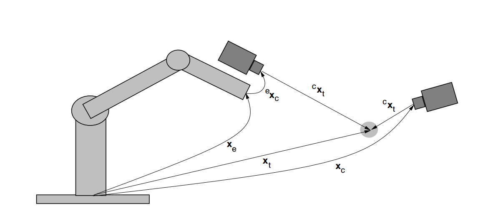
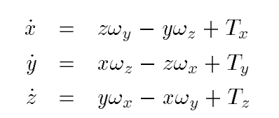
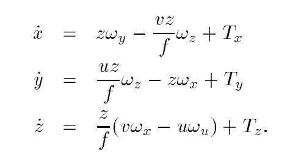

# visual servo

[TOC]

## 1.Define

1. Move from current to desired robot configuration
2. Control feedback generated by computer vision techniques

## 2.Classification

Controlling Robots using visual information
• Camera location: Eye-in-hand vs. **fixed**
• Camera: mono vs. **stereo**
• Control: **image-based** vs. position-based

## 3.image based visual servo

Determine a error function $$e$$,  when the task is achieved, $$e=0$$.

$$e=f-f_d$$     (1)

where $$f_d$$: desired image features, $$f$$: image feature with respect to moving object.

**Note:** $$f$$ is designed in image  parameter space, not task space.

For insertion machine 

- if camera is fixed type:

  $$f_d$$: coordinates of  holes.

  $$f$$: coordinates of pins.

- if camera is eye-in-hand type:

  $$f_d$$: coordinates of pins

  $$f$$: coordinates of holes

### A. Basic components

Let $$r$$ represent coordinates of the end-effector and $$\dot{r}$$ represent the corresponding end-effector velocity,  $$f$$ represent a vector of image features, then 

$$\dot{f}=J_v(r)\dot{r}$$     (2)

where $$J_v(r)∈R^{k*6}$$  is called jacobian matrix.

Using (1) and (2)

$$\dot{e}=J_v(r)\dot{r}$$ 

If we ensure an exponential decoupled decrease of the error($$\dot{e}=-Ke$$)

$$\dot{r}=J_v^{+}(r)\dot{e}=-KJ_v^{+}(r)e(f)=-KJ_v^{+}(r)(f-f_d)$$

### B. The image jacobian

Note that $$J_v(r)∈R^{k*6}$$

if $$k=6$$, then $$ J_v^{+}=J_v^{-1}$$

if $$k>6$$, then $$ J_v^{+}=J_v^{T}(J_{v}J_{v}^{T})^{-1}$$

if $$k<6$$, then $$\dot{r} =J_v^{+}(\dot{f})+(I-J_v^{+}J_{v})b$$, and all vectors of the form $$(I-J_v^{+}J_{v})b$$  lie in the null space of $$J_v$$ 

> **In our case**
>
> We use two eye-in-hand cameras, so $$k=8 $$, note that we use mask to filter some dimensions
>

### C. An Example Image Jacobian

#### I. The velocity of a  rigid object

Consider the robot end-effector moving in a workspace. In base coordinates, the motion is described by an angular velocity $$Ω(t) = [w_x(t),w_y(t), w_z(t)]^T$$ and a translational velocity $$T(t) = [T_x(t),T_y(t),T_z (t)]^T$$.  Let $$P$$ be a point that is rigidly attached to the end-effector, with base frame coordinates $$[x, y , z]^T$$ . The derivatives of the coordinates of $$P$$ with respect to base coordinates are given by 

**Note**: any objects rigidly attached to the end-effector share the same angular and translational velocity.

which can be written in vector notation as 

This can be written concisely in matrix form by noting that the cross product can be represented in terms of the skew-symmetric matrix 

allowing us to write 

Together, $$T$$ and $$Ω$$ define what is known in the robotics literature as a velocity screw 

#### II.**Review pinhole camera model**

A point, $$^{c}P = [x, y, z]^T$$ , whose coordinates are expressed with respect to the camera coordinate frame, will project onto the image plane with coordinates $$p = [u, v]^T$$ , given by

#### III.Example

Suppose that the end-effector is moving with angular velocity $$Ω(t)$$ and translational velocity $$T$$ both with respect to the camera frame in a xed camera system. Let $$p$$ be a point **rigidly** attached to the end-effector. The velocity of the point $$p$$, expressed relative to the camera frame, is given by 

To simplify notation, let $$^{c}\dot{P} = [x, y,z]^T $$. we can write the derivatives of the coordinates of p in terms of the image feature parameters $$u,v$$ as 

Now, let $$f = [u, v]^T$$ , as above and using the quotient rule 

Finally, we may rewrite these two equations in matrix form to obtain

which is an important result relating image-plane velocity of a point to the relative velocity of the point with respect to the camera. 

visual control by simply stacking the Jacobians for each pair of image point coordinates

## 4.code

#### I.Base class

Base class is `VisualServo`,  `VisualServoPositionBase` and `VisualServoImageBase`

~~~python
class VisualServo(object):
    @classmethod
    def _calImageJacobian(cls, intrinsic, x, y, z):
        fx = intrinsic[0, 0] # focal length
        fy = intrinsic[1, 1]
        cx = intrinsic[0, 2] # center
        cy = intrinsic[1, 2]

        u = x - cx
        v = y - cy
        J = np.array([[fx/z,    0, -u/z,        -(u*v)/fy, (fx**2+u**2)/fx, -(fx*v)/fy],
                      [   0, fy/z, -v/z, -(fy**2+v**2)/fy,        (u*v)/fx, (fy*u)/fx]])
        return J

    @classmethod
    def filterMoveDimension(cls, JMatrix, mask=(1,1,1,1,1,1)):
        assert isinstance(JMatrix, np.ndarray)
        assert JMatrix.shape[1] == len(mask), 'The column of JMatrix == len(Mask)'

        NonZero = np.nonzero(mask)
        FilterMatrix = np.zeros_like(JMatrix)
        FilterMatrix[:, NonZero] = JMatrix[:, NonZero]
        return FilterMatrix

    @classmethod
    def skewMatrix(cls, t):
        '''
        sk(p) = [0, -z, y
                 z, 0, -x
                 -y, x, 0]
        :param t:
        :return:
        '''
        assert t.shape == (3,1), 't must be a 3 by 1 vector'
        sk = np.array([[      0, -t[2,0],  t[1,0]],
                       [ t[2,0],       0, -t[0,0]],
                       [-t[1,0],  t[0,0],       0]])
        return sk

    @classmethod
    def _velocityTranMatrix(cls, Tx2x):
        R_cr = Tx2x[0:3, 0:3]
        t_cr = Tx2x[0:3, 3].reshape(3,1)
        sk_t = cls.skewMatrix(t_cr)

        VMatrix_c2r = np.hstack((R_cr, np.dot(sk_t, R_cr)))
        temp = np.hstack((np.zeros((3,3)), R_cr))
        VMatrix_c2r = np.vstack((VMatrix_c2r, temp))

        return VMatrix_c2r

    @classmethod
    def transVelocity(cls, Tx2x, velocity):
        return cls._velocityTranMatrix(Tx2x=Tx2x).dot(velocity)

    # @classmethod
    # def velocityPose2T(cls, velocityPose):
    #     DeltaPose = np.zeros((6,1)).astype('float32')
    #     DeltaPose[:3] = velocityPose[:3]
    #     DeltaPose[3]  = velocityPose[5]/math.pi*180
    #     DeltaPose[4]  = velocityPose[4]/math.pi*180
    #     DeltaPose[5]  = velocityPose[3]/math.pi*180
    #     T = core.Pose2T(pose=DeltaPose)
    #     return T

    @classmethod
    def velocityPose2Move(cls, velocityPose, iter=1):
        assert isinstance(velocityPose, np.ndarray)
        assert velocityPose.shape == (6,1)

        VelocityPoseStep = velocityPose / float(iter)
        TStep = np.matrix(cls._velocityPose2T(velocityPose=VelocityPoseStep))
        T = TStep ** iter
        return np.array(T)

    @classmethod
    def _velocityPose2T(cls, velocityPose):
        assert velocityPose.shape == (6,1)

        v = velocityPose[0:3]
        Omega = velocityPose[3:6]
        sk_Omega = cls.skewMatrix(Omega)
        T_rot = np.identity(4)
        T_rot[0:3, 0:3] += sk_Omega
        T_rot[0:3, 3] += v.reshape(-1,)
        return T_rot
~~~

#### II.ViusalServoImageBase

~~~python
class VisualServoImageBase(VisualServo):

    @classmethod
    def matchPP(cls, intrinsic, objPts_2xn, tarPts_2xn, z_1xn, Tc2x, mask=(1,1,1,1,1,1)):
        assert len(objPts_2xn.shape)==2 and objPts_2xn.shape[0] == 2, 'ObjPts is not a 2 by N matrix'
        assert len(objPts_2xn.shape)==2 and objPts_2xn.shape[0] == 2, 'TarPts is not a 2 by N matrix'
        assert isinstance(z_1xn, np.ndarray), 'z_1byN must be ndarray'
        assert objPts_2xn.shape[1] == tarPts_2xn.shape[1] and objPts_2xn.shape[1] == z_1xn.shape[1], 'N must be the same'
        assert objPts_2xn.shape[1] > 0, 'N must bigger than 0'
		# 将速度从camera坐标系转换到x坐标系中（x:robot base或者tool），转换对象是tool还是目标？
        velocity_matrix_c2r = cls._velocityTranMatrix(Tx2x=Tc2x)
        J = None
        ef = None
        for i in range(0, objPts_2xn.shape[1]):
            Jtemp = cls._calImageJacobian(intrinsic=intrinsic, x=objPts_2xn[0,i], y=objPts_2xn[1, i], z=z_1xn[0, i])
            # 将jacobian矩阵转换到以robot base为参考坐标系
            Jtemp = np.dot(Jtemp, np.linalg.inv(velocity_matrix_c2r))
            eftemp = (objPts_2xn[:, i] - tarPts_2xn[:, i]).reshape(2,1)
            if i == 0:
                J  = copy.deepcopy(Jtemp)
                ef = copy.deepcopy(eftemp)
            else:
                J  = np.vstack((J, Jtemp))
                ef = np.vstack((ef, eftemp))
        #由于只用了两个相机，jcobian矩阵的行数为4，这样可能导致jcobian矩阵无法求逆。因此通过mask掉某些列来解决。
        J = cls.filterMoveDimension(JMatrix=J, mask=mask)
        return J, ef

    @classmethod
    def matchPPs(cls, intrinsic_list, objPts_2xn_list, tarPts_2xn_list, z_1xn_list, Tc2x_list, mask=(1,1,1,1,1,1)):
        assert len(intrinsic_list) == len(objPts_2xn_list) == len(tarPts_2xn_list) == len(z_1xn_list) == len(Tc2x_list)
		#相机为2个，所以intrinsic_list长度为2
        Num = len(intrinsic_list)
        J, Ef = None, None
        for i in xrange(Num):
            TempJ, TempEf = \
                cls.matchPP(intrinsic=intrinsic_list[i],
                            objPts_2xn=objPts_2xn_list[i],
                            tarPts_2xn=tarPts_2xn_list[i],
                            z_1xn=z_1xn_list[i],
                            Tc2x=Tc2x_list[i],
                            mask=mask)
            if 0 == i:
                J = TempJ.copy()
                Ef = TempEf.copy()
            else:
                J = np.vstack((J, TempJ))
                Ef = np.vstack((Ef, TempEf))
        Velocity = np.linalg.pinv(J).dot(Ef)
        return Velocity

    @classmethod
    def matchPL(cls):
        pass
~~~

#### III. Image-based visual servo simulated in Gazebo

