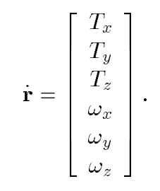

## Pipeline

### 安装gazebo

gazebo安装。安装教程可以像张亚萍要。

### 安装visual servoing的gazebo仿真环境（模型）

建立一个工作空间文件夹，命名为catkin_ws。在之下建立一个src文件夹，用于存放catkin_ws/src/rr_robot模型文件夹和catkin_ws/src/CmakeLists.txt文件。

1. 安装依赖

   在 rr_robot_plugin/install/ 下，有armadillo，PQP，yaml三个库的打包文件，将相关压缩包分别解压后，在各自的文件夹下，打开terminal，输入以下命令进行安装：

   ~~~shell
   $ mkdir build
   $ cd build
   $ cmake ..
   $ make -jx
   $ sudo make install
   ~~~

2. 编译ros文件夹

   返回ROS工作目录即本例中的catkin_ws目录，打开terminal，输入：

   ~~~shell
   $ catkin_make
   ~~~

   这个时候会多出两个文件夹，分别为devel文件夹和build文件夹。

   ps：在 飞哥给我的电脑中，工作空间中还有backup文件夹，里面存放着强化学习仿真模型。

3. 使用

   在catkin_ws/src/rr_robot文件夹下面打开terminal输入以下命令进行启动。前者为zhongdayi版本，后者为dashixiong版本。

   ~~~shell
   roslaunch rr_robot_gazebo kent6v2robot_control.launch#zhongdayi
   #或者
   roslaunch rr_robot_gazebo kent6v2position_control.launch#dashixiong
   ~~~

   ​

### Visual Servo仿真

- 增加的代码文件

在catkin_ws/src/rr_robot/rr_robot_plugin/pythonInterface/GazeboInterface下增加了visaulServo文件夹，包括如下文件，其中toolbox为视觉库。CamerCalibrationData.yaml为相机的参数...

- 使用

  在gazebo的仿真环境已经打开的情况下，执行

  ~~~shell
  python VisualServo.py
  ~~~

  ​

## visual servo算法

### 1.Define

1. Move from current to desired robot configuration
2. Control feedback generated by computer vision techniques

### 2.Classification

Controlling Robots using visual information
• Camera location: Eye-in-hand vs. **fixed**
• Camera: mono vs. **stereo**
• Control: **image-based** vs. position-based

### 3.image based visual servo

Determine a error function $$e$$,  when the task is achieved, $$e=0$$.

$$e=f-f_d$$     (1)

where $$f_d$$: desired image features, $$f$$: image feature with respect to moving object.

**Note:** $$f$$ is designed in image  parameter space, not task space.

For insertion machine 

- if camera is fixed type:

  $$f_d$$: coordinates of  holes.

  $$f$$: coordinates of pins.

- if camera is eye-in-hand type:

  $$f_d$$: coordinates of pins

  $$f$$: coordinates of holes

#### A. Basic components

Let $$r$$ represent coordinates of the end-effector and $$\dot{r}$$ represent the corresponding end-effector velocity,  $$f$$ represent a vector of image features, then 

$$\dot{f}=J_v(r)\dot{r}$$     (2)

where $$J_v(r)∈R^{k*6}$$  is called jacobian matrix.

Using (1) and (2)

$$\dot{e}=J_v(r)\dot{r}$$ 

If we ensure an exponential decoupled decrease of the error($$\dot{e}=-Ke$$)

$$\dot{r}=J_v^{+}(r)\dot{e}=-KJ_v^{+}(r)e(f)=-KJ_v^{+}(r)(f-f_d)$$

#### B. The image jacobian

Note that $$J_v(r)∈R^{k*6}$$

if $$k=6$$, then $$ J_v^{+}=J_v^{-1}$$

if $$k>6$$, then $$ J_v^{+}=J_v^{T}(J_{v}J_{v}^{T})^{-1}$$

if $$k<6$$, then $$\dot{r} =J_v^{+}(\dot{f})+(I-J_v^{+}J_{v})b$$, and all vectors of the form $$(I-J_v^{+}J_{v})b$$  lie in the null space of $$J_v$$ 

> **In our case**
>
> We use two eye-in-hand cameras, so $$k=8 $$, note that we use mask to filter some dimensions
>

#### C. An Example Image Jacobian

##### I. The velocity of a  rigid object

Consider the robot end-effector moving in a workspace. In base coordinates, the motion is described by an angular velocity $$Ω(t) = [w_x(t),w_y(t), w_z(t)]^T$$ and a translational velocity $$T(t) = [T_x(t),T_y(t),T_z (t)]^T$$.  Let $$P$$ be a point that is rigidly attached to the end-effector, with base frame coordinates $$[x, y , z]^T$$ . The derivatives of the coordinates of $$P$$ with respect to base coordinates are given by 

**Note**: any objects rigidly attached to the end-effector share the same angular and translational velocity.

which can be written in vector notation as 

This can be written concisely in matrix form by noting that the cross product can be represented in terms of the skew-symmetric matrix 

allowing us to write 

Together, $$T$$ and $$Ω$$ define what is known in the robotics literature as a velocity screw.

##### II.**Review pinhole camera model**

A point, $$^{c}P = [x, y, z]^T$$ , whose coordinates are expressed with respect to the camera coordinate frame, will project onto the image plane with coordinates $$p = [u, v]^T$$ , given by

##### III.Example

Suppose that the end-effector is moving with angular velocity $$Ω(t)$$ and translational velocity $$T$$ both with respect to the camera frame in a fixed camera system. Let $$P$$ be a point **rigidly** attached to the end-effector. The velocity of the point $$P$$, expressed relative to the camera frame, is given by 

To simplify notation, let $$^{c}P = [x, y,z]^T $$. we can write the derivatives of the coordinates of p in terms of the image feature parameters $$u,v$$ as 

Now, let $$f = [u, v]^T$$ , because 

then we can get

Finally, we may rewrite these two equations in matrix form to obtain

which is an important result relating **image-plane velocity** **of a point** to **the relative velocity of the point with respect to the camera**. 

Visual control by simply stacking the Jacobians for each pair of image point coordinates

